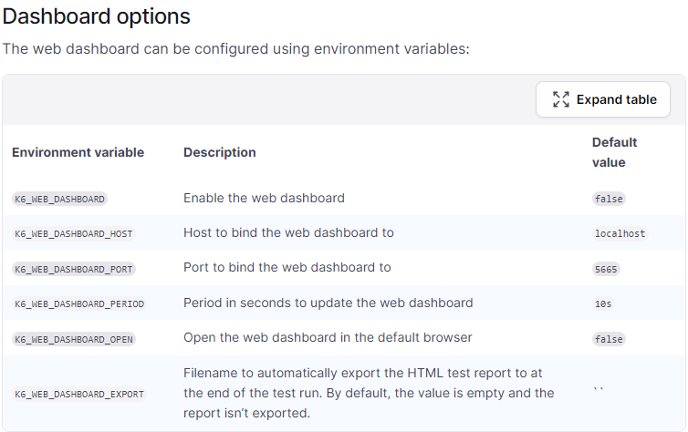
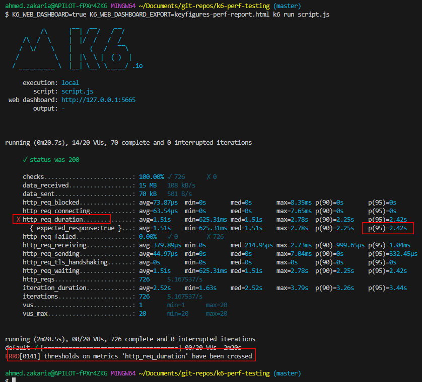

# k6-perf-test-demo
k6 is a JS open-source tool for load testing APIs and web applications. It simulates multiple virtual users to stress test performance under load.
# Installation
* **[Windows](https://k6.io/docs/get-started/installation/#windows)**
* **[macOS](https://k6.io/docs/get-started/installation/#macos)**

# Run JS test script
```bash
k6 run script.js
```
# Run test script with dashboard
```bash
K6_WEB_DASHBOARD=true k6 run script.js
```
# Run test script with dashboard and export the report to html for later analysis
```bash
K6_WEB_DASHBOARD=true K6_WEB_DASHBOARD_EXPORT=keyfigures-perf-report.html k6 run script.js
```
### Default Dashboard configurations


# Sample Test Script:
```javascript
import http from 'k6/http';
import { check, sleep } from 'k6';

export const options = {
  thresholds: {
    // Define threshold for http_req_duration metric
    // 95 percent of the http requests must have reponse time less than 350 ms
    'http_req_duration': ['p(95)<350'], // 95th percentile response time < 350ms
  },
  stages: [
    { duration: '30s', target: 20 },
    { duration: '1m30s', target: 10 },
    { duration: '20s', target: 0 },
  ],
};
// default function contains the main test logic for each virtual user.
//executed repeatedly for each VU until the test duration specified in the options section is reached or the test is manually stopped.
export default function () {
  const res = http.get('http://localhost:5004/finance/KeyFigure');
  check(res, { 'status was 200': (r) => r.status == 200 });
  sleep(1);
}
```
## Explanation of Stages:
This k6 script utilizes the `stages` configuration to simulate a gradual increase in virtual users (VUs) followed by a decrease, simulating real-world load pattern:

* **Stage 1:**
  - **Duration:** Lasts for 30 seconds (`'30s'`).
  - **Target:** Aims to have 20 virtual users (`target: 20`). Simulating a gradual increase of the load on the service.
* **Stage 2:**
  - **Duration:** Lasts for 1 minute and 30 seconds (`'1m30s'`).
  - **Target:** Maintains a steady load of 10 virtual users (`target: 10`). simulating sustained pressure on the service.
* **Stage 3:**
  - **Duration:** Lasts for 20 seconds (`'20s'`).
  - **Target:** Gradually ramps down the load to 0 virtual users (`target: 0`). Simulating a decrease in the load.


## Sample Console Output 
### Response times exceeded the 95th percentile threshold (p(95)<350). 95 percent of the requests had response times less than or equal to 2.4 seconds
